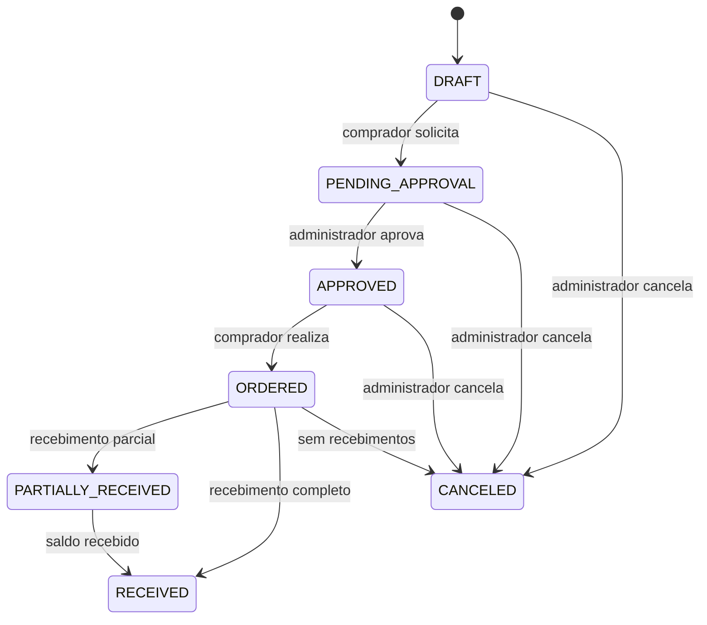

# Regras de negócio da V1

## Organização, primeira utilização e usuários

Cada restaurante é uma organização. Usuários e registros operacionais pertencem a uma única organização. O cadastro inicial cria o restaurante, um proprietário e categorias iniciais de ingredientes e financeiro; não inventa estoque, compras ou saldo de caixa.

O primeiro inventário estabelece as quantidades existentes. Todos os novos ingredientes começam com saldo e custo médio iguais a zero. Em seguida, o responsável registra receitas, despesas, fornecedores e compras reais. O seed é uma base fictícia de demonstração separada desse fluxo.

| Operação | OWNER / ADMIN | BUYER | OPERATOR | VIEWER |
| --- | --- | --- | --- | --- |
| Consultar estoque, fornecedores, compras e consumo | Sim | Sim | Sim | Sim |
| Cadastrar / editar ingrediente e categorias | Sim | Não | Não | Não |
| Registrar consumo, perda, ajustes e inventário | Sim | Não | Sim | Não |
| Cadastrar fornecedor e pesquisar preço | Sim | Sim | Não | Não |
| Criar lista, cotação e pedido | Sim | Sim | Não | Não |
| Solicitar aprovação e realizar pedido aprovado | Sim | Sim | Não | Não |
| Aprovar ou cancelar pedido | Sim | Não | Não | Não |
| Confirmar recebimento | Sim | Não | Sim | Não |
| Consultar financeiro | Sim | Não | Não | Sim |
| Registrar receita / despesa / pagamento / cancelamento financeiro | Sim | Não | Não | Não |
| Administrar usuários e auditoria | Sim | Não | Não | Não |

Somente OWNER pode cadastrar outro OWNER. A autorização é validada no servidor em cada operação. Referências a ingredientes, categorias, fornecedores, pedidos e lançamentos de outra organização são recusadas. Relações entre organizações diferentes também são proibidas pelas chaves estrangeiras compostas do PostgreSQL.

## Ingredientes e estoque

Um ingrediente possui nome, categoria opcional, descrição, unidade, mínimo e ideal. Unidades suportadas: KG, G, L, ML, UNIT, PACKAGE e BOX. O sistema não converte unidades automaticamente; uma compra e um consumo usam a unidade cadastrada.

O estoque ideal deve ser maior ou igual ao mínimo. Quantidades, custos unitários e custos médios usam `Decimal(14,4)`. Valores totais monetários usam `Decimal(14,2)`. Entradas HTTP transportam números decimais como strings com ponto, sem notação científica ou conversão para ponto flutuante. Os limites são validados antes da gravação.

Toda mudança de saldo gera uma movimentação. O saldo não pode ser negativo e não pode ser alterado por edição do cadastro. O banco valida a igualdade entre `currentStock` e o saldo acumulado do histórico no commit da transação.

| Tipo | Direção / finalidade |
| --- | --- |
| PURCHASE | Entrada por recebimento de compra |
| CONSUMPTION | Saída por uso no restaurante ou evento |
| ADJUSTMENT_IN | Entrada por correção manual |
| ADJUSTMENT_OUT | Saída por correção manual |
| INVENTORY_ADJUSTMENT | Entrada ou saída gerada na finalização do inventário |
| LOSS | Saída por perda, vencimento ou descarte |
| OTHER | Entrada ou saída com direção explícita e justificativa |

A quantidade informada e armazenada é positiva; a direção IN/OUT determina o efeito no saldo. A movimentação guarda responsável, quantidade, custo, saldo anterior, saldo posterior, referência, observações e contexto de uso. O contexto RESTAURANT, EVENT ou OTHER permite acompanhar uso do mesmo estoque em restaurante e eventos.

Perdas, ajustes manuais e movimentações OTHER exigem motivo. Ajustes de inventário só podem ser gerados pelo service de finalização. Entradas PURCHASE usam o processo de recebimento, garantindo vínculo com pedido, fornecedor e financeiro. Movimentações históricas não podem ser editadas ou apagadas; correções produzem novas movimentações.

Ingredientes inativos não recebem novas movimentações. Para desativar um ingrediente com estoque, zere seu saldo através de uma movimentação justificada. A unidade não pode mudar após qualquer movimentação histórica; cadastre um novo ingrediente quando a unidade operacional mudar.

## Custos

Uma saída usa o custo médio vigente e preserva esse custo médio no cadastro. Uma entrada com custo conhecido recalcula:

```text
novo custo médio =
  (saldo anterior × custo médio anterior + quantidade recebida × custo unitário recebido)
  ÷ (saldo anterior + quantidade recebida)
```

O resultado é arredondado ao final para quatro casas decimais. O valor monetário da movimentação é quantidade × custo unitário, arredondado para duas casas. O cálculo usa Decimal em todas as etapas.

Ajustes sem custo informado preservam o custo médio vigente. O inventário inicial registra quantidades sem criar despesas fictícias; seu custo médio começa em zero quando ainda não existe um custo registrado. Esse custo inicial desconhecido precisa ser considerado ao interpretar a valorização do estoque. A V1 prioriza quantidades e pagamentos reais; a ficha técnica dos pratos pertence à V2.

Frete integra o total da compra e a conta a pagar. Na V1, o custo unitário do ingrediente e seu custo médio usam o preço da linha da compra; frete não é distribuído no custo médio de cada ingrediente.

## Inventários

Somente um inventário pode ficar aberto por organização. A abertura inclui todos os ingredientes ativos existentes naquele instante e guarda quantidade do sistema e timestamp de atualização de cada ingrediente.

Na finalização, é obrigatório informar todos os itens do inventário, uma única vez cada, com quantidade contada não negativa. Para cada item:

```text
diferença = quantidade contada − quantidade do sistema na abertura
```

Diferença positiva cria entrada INVENTORY_ADJUSTMENT; negativa cria saída; zero não cria movimentação. A transação persiste contagens, diferenças, movimentações, saldos, responsável, horário de conclusão e auditoria.

Uma alteração do saldo ou do cadastro do ingrediente após o snapshot torna a contagem desatualizada. O service recusa a finalização e mantém o inventário aberto sem ajustes parciais. O responsável cancela a contagem e inicia outra. Um inventário concluído ou cancelado não pode ser concluído novamente nem sobrescrito.

## Alertas e necessidades de compra

Um ingrediente ativo precisa de atenção quando:

```text
saldo atual <= estoque mínimo
```

A reposição sugerida recompõe até o ideal:

```text
quantidade sugerida = máximo(estoque ideal − saldo atual, 0)
```

Somente sugestões positivas entram na lista automática. Itens já presentes em listas abertas, em cotação ou com pedidos em andamento são indicados como já solicitados e não são duplicados em uma nova geração. Gerar novamente reaproveita uma lista aberta ou a necessidade em andamento. A lista guarda um snapshot de saldo, mínimo, ideal e sugestão; a quantidade solicitada pode ser ajustada antes da cotação conforme as validações do service.

Para comprar de fornecedores diferentes, o responsável mantém somente o grupo desejado em uma lista ainda aberta e sem cotações ou pedidos. Os itens retirados voltam às necessidades de compra. Depois de registrar a cotação do primeiro grupo, gere outra lista para os demais ingredientes. Listas já cotadas preservam seus itens e quantidades; essa sequência permite pedidos separados sem reservar o mesmo ingrediente duas vezes.

Alertas são internos, exibidos no dashboard e no estoque. Não enviam WhatsApp, e-mail ou push nesta versão.

## Fornecedores e pesquisa de preço

Fornecedores podem ter contatos, documento, endereço e observações. A relação fornecedor–ingrediente guarda último preço, quantidade mínima, prazo, condição de pagamento e última compra.

Cada preço manual, cotação ou recebimento preserva um registro em `SupplierPriceHistory` com origem MANUAL, QUOTE ou PURCHASE. Atualizar o preço atual nunca elimina o preço anterior. Condições comerciais cadastradas manualmente não são apagadas por um recebimento que apenas atualiza preço e data da compra.

Cotação e escolha de fornecedor exigem registros ativos. Um recebimento de pedido já autorizado pode preservar histórico de preço de fornecedor que foi desativado; seus ingredientes precisam continuar ativos.

## Cotações e decisão humana

Uma cotação pertence a uma lista e um fornecedor da mesma organização. Deve informar todos os itens da lista, incluindo os indisponíveis. Itens disponíveis precisam atender à quantidade solicitada e ao mínimo conhecido do fornecedor.

A comparação apresenta preços, totais, frete, disponibilidade, prazo, qualidade e condições de pagamento. O sistema não escolhe automaticamente o menor preço. O usuário seleciona uma cotação e registra o motivo da escolha. Uma cotação expirada ou que não atenda a todos os itens não pode originar pedido.

A validade informada como dia inclui o término desse dia no fuso de São Paulo. Ao realizar o pedido, o sistema verifica novamente se a cotação permanece válida.

## Pedido e aprovação



BUYER pode criar, solicitar aprovação e realizar um pedido aprovado. OWNER ou ADMIN aprova. Somente OWNER ou ADMIN cancela, e um pedido com qualquer recebimento não pode ser cancelado. O sistema recusa transições que pulem a aprovação ou contrariem o estado atual.

A lista fica ORDERED quando sua cotação é selecionada. Um cancelamento sem recebimentos libera a lista para nova cotação. A cotação selecionada não gera outro pedido automaticamente.

## Recebimento e idempotência

Somente pedidos ORDERED ou PARTIALLY_RECEIVED podem ser recebidos. Cada quantidade precisa ser positiva e não pode ultrapassar o saldo não recebido da linha. Itens que não pertencem ao pedido, inclusive de outra organização, são recusados.

O recebimento pode ser parcial. Cada recebimento válido cria seu registro e itens, entradas de estoque, novo custo médio, histórico de preço, atualização de quantidades recebidas, conta a pagar e auditoria, dentro da mesma transação.

O valor de cada linha parcial é calculado por arredondamento cumulativo, de forma que a soma dos recebimentos da linha corresponda ao total comprado. O frete é distribuído proporcionalmente ao valor recebido, e o último recebimento absorve o restante do arredondamento. Se todos os preços forem zero, o frete restante é registrado no recebimento final.

Cada recebimento utiliza uma chave de idempotência única por organização. A repetição com os mesmos dados retorna o resultado anterior sem entradas ou despesas duplicadas. Reutilizar a chave com outro pedido ou outras quantidades é recusado. Uma transação que falha não consome a chave, e pode ser tentada novamente após corrigir o problema.

Ao receber todas as quantidades, o pedido fica RECEIVED e a lista fica CLOSED. Uma falha durante o processo desfaz todas as alterações, inclusive as primeiras entradas que já tinham sido processadas dentro da transação.

## Financeiro gerencial

Lançamentos possuem tipo INCOME/EXPENSE, categoria correspondente, descrição, valor positivo, vencimento e status PENDING/PAID/CANCELED. Compras recebidas geram despesas PENDING vinculadas ao recebimento; entregas parciais geram contas correspondentes ao valor efetivamente recebido.

Registrar um pagamento apenas muda o status gerencial para PAID e grava a data informada ou o instante atual. Datas futuras de pagamento são recusadas; lançamentos históricos já pagos podem informar sua data efetiva. O sistema não movimenta contas bancárias nem envia dinheiro. Um lançamento pago não pode ser pago novamente. Cancelamentos exigem motivo e respeitam as restrições do service; uma despesa vinculada a recebimento não é apagada para desfazer uma compra.

Entradas, despesas e resultado do período consideram lançamentos PAID e a data de pagamento. Saldo financeiro é a soma das receitas pagas menos as despesas pagas de todo o histórico. A tela de contas a pagar inclui todas as despesas PENDING, inclusive vencidas fora do mês escolhido, ordenadas pelo vencimento. Gastos com compras consideram os recebimentos do período, incluindo os ainda não pagos; por isso podem diferir da saída efetiva de caixa.

O sistema permite período personalizado e oferece atalhos na interface. Uma data final anterior à inicial é recusada. Relatórios e filtros usam o fuso de São Paulo. Os números são gerenciais e não constituem contabilidade fiscal, DRE formal ou conciliação bancária.

## Auditoria e proteção de dados

Alterações de estoque, inventários, preços, compras, estados de pedidos, recebimentos, pagamentos e cancelamentos registram organização, responsável, entidade, ação, horário e detalhes relevantes. AuditLog, StockMovement, SupplierPriceHistory e os registros de recebimento são imutáveis no banco.

Operações críticas usam transações com isolamento serializável e repetição limitada de conflitos. Saídas concorrentes não podem gastar o mesmo saldo duas vezes. O registro de saldo e histórico só é confirmado quando ambos concordam.

## Verificação automatizada

Os testes unitários cobrem saldo, limite mínimo, sugestões, custo médio, precisão, ajustes, snapshots, validação e autorizações. A suíte de PostgreSQL real cobre o ciclo completo, escolha humana de fornecedor, aprovação, entregas parciais, idempotência simultânea, despesas, histórico de preços, isolamento de organizações, rollback após a primeira entrada, saídas concorrentes e imutabilidade do histórico.

Os testes de integração usam um banco separado e organizações únicas a cada execução. Não alteram o seed de demonstração. As instruções para executá-los estão em `architecture.md` e no README.
