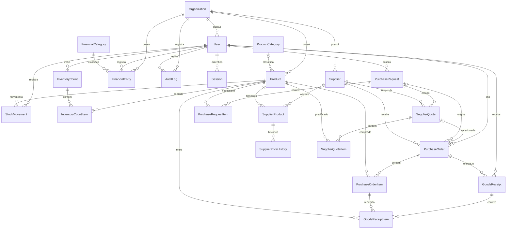

# Modelo de dados

O PostgreSQL mantém uma organização por restaurante. Todas as entidades de negócio e seus itens carregam `organizationId`. Relações entre registros de negócio usam chaves estrangeiras compostas `[id, organizationId]`, impedindo que um item da organização A aponte para um produto, pedido, fornecedor, categoria ou usuário da organização B. Os serviços também filtram suas consultas pelo ator autenticado.

`User.email` é globalmente único na V1: cada conta participa de uma organização. O modelo permite múltiplas organizações independentes; associação de uma mesma pessoa a várias organizações fica para evolução futura.

## Entidades

| Grupo | Entidades | Responsabilidade |
| --- | --- | --- |
| Acesso | Organization, User, Session, AuthRateLimit | Restaurante, papéis, sessões revogáveis e limite persistente de tentativas |
| Estoque | ProductCategory, Product, StockMovement | Ingredientes, limites, saldo, custo médio e livro de movimentações |
| Inventário | InventoryCount, InventoryCountItem | Contagem física, fotografia do saldo e diferenças |
| Fornecedores | Supplier, SupplierProduct, SupplierPriceHistory | Cadastro, vínculo com ingrediente e histórico de preços |
| Compras | PurchaseRequest, PurchaseRequestItem | Lista de necessidades e quantidades solicitadas |
| Cotação | SupplierQuote, SupplierQuoteItem | Preços, disponibilidade, frete, prazo, qualidade e condição de pagamento |
| Pedido | PurchaseOrder, PurchaseOrderItem | Aprovação, encomenda, quantidades pedidas e recebidas |
| Recebimento | GoodsReceipt, GoodsReceiptItem | Entregas parciais ou totais e chave de idempotência |
| Financeiro | FinancialCategory, FinancialEntry | Receitas, despesas, contas pendentes, pagamentos e cancelamentos |
| Auditoria | AuditLog | Usuário, ação, entidade, registro e detalhes da alteração |

## Relacionamentos

Todas as tabelas de negócio representadas acima também se relacionam com `Organization`; essas linhas foram omitidas do diagrama para facilitar a leitura. `AuthRateLimit` é uma tabela operacional de autenticação, identificada por hash do escopo e e-mail, sem dados de restaurante nem senhas.

## Precisão e invariantes

- Dinheiro total usa `Decimal(14,2)`. Quantidades, preço por unidade e custo médio usam `Decimal(14,4)`. Cálculos são realizados com `Prisma.Decimal`; arredondamento monetário acontece nos totais.
- `StockMovement.quantity` é sempre positiva. `direction` indica entrada ou saída; `stockBefore` e `stockAfter` registram os saldos. `INVENTORY_ADJUSTMENT` pode ter qualquer direção. `usageContext` distingue consumo no restaurante, em eventos e outros usos.
- Saldo, custo, limites e contagem física não podem ser negativos. O estoque ideal não pode ser inferior ao mínimo; a quantidade recebida nunca excede a quantidade pedida.
- Constraint triggers adiados até o commit verificam que `Product.currentStock` corresponde à soma das movimentações. Uma alteração de saldo e seu lançamento precisam acontecer na mesma transação.
- Movimentações, histórico de preços, recebimentos, itens de recebimento e auditoria são preservados: triggers recusam alterações e exclusões. Correções de estoque criam ajustes e correções financeiras ficam auditadas.
- A fotografia `InventoryCountItem.snapshotUpdatedAt` identifica mudanças de estoque desde o início da contagem. Um inventário desatualizado precisa ser refeito para evitar sobrescrever uma movimentação posterior.
- `GoodsReceipt` possui chave única `[organizationId, idempotencyKey]`. Repetir a confirmação de uma mesma entrega não duplica saldo ou despesa.
- `FinancialEntry` possui referência única `[organizationId, referenceType, referenceId]` quando a referência está preenchida. Uma entrega gera no máximo um lançamento financeiro.
- A chave estrangeira da categoria financeira também inclui `type`, impedindo associar uma despesa a uma categoria de receita. A referência do item recebido inclui `productId`, garantindo que corresponda ao ingrediente do item pedido.
- `SupplierQuote` pode originar um pedido. O fluxo da V1 atende entregas parciais por pedido; cada entrega registra o valor correspondente. O frete é rateado entre recebimentos e incluído na despesa, sem duplicação. O custo médio dos ingredientes considera o preço por unidade; a V1 não rateia frete entre os produtos.
- Exclusões de cadastros usados no histórico são protegidas por `onDelete: Restrict`. Produtos e fornecedores deixam de participar de novas operações pelo campo `active`.

## Sessões e operações concorrentes

O navegador recebe um token aleatório em cookie HttpOnly, SameSite Lax e Secure em produção. A tabela `Session` armazena somente seu SHA-256 e validade. O servidor recupera o usuário ativo e o papel atual em cada solicitação, permitindo revogar sessões e desativar contas sem esperar o cookie expirar. O token tem validade de sete dias.

Operações críticas usam transação `Serializable`, com tentativas limitadas em conflitos de serialização. Nenhuma integração externa participa dessas transações. A aplicação não usa RLS específico de Supabase nem extensões proprietárias; as mesmas migrations funcionam em PostgreSQL gerenciado por Neon, Supabase ou outro provedor.

## Referências e rastreabilidade

`referenceType` e `referenceId` conectam movimentações e lançamentos a inventários e recebimentos. Como podem apontar para entidades de tipos diferentes, essas referências são validadas pelos serviços; a integridade de produtos, usuários, categorias e itens utiliza chaves estrangeiras reais. `AuditLog.details` guarda JSON com informações operacionais, sem senha ou token de sessão.

O seed de demonstração usa somente dados fictícios, começa com um inventário e mantém os saldos compatíveis com as entradas e consumos. Onboarding de organizações reais começa com saldo zero e exige inventário inicial; o seed não faz parte do deploy de produção.
